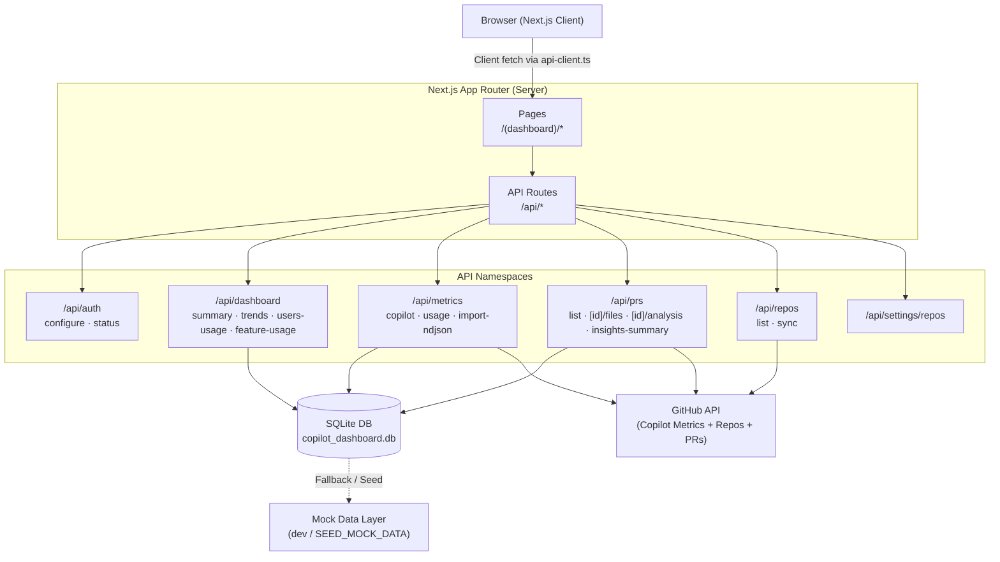

# Copilot Dashboard

   

An organization-wide analytics dashboard for tracking GitHub Copilot usage — built with Next.js 15 App Router and Material UI.

---

## Features

- **Executive Dashboard** — KPI cards for lines suggested/accepted, acceptance rate, active users, commits, PRs, and chats
- **Drilldown Modals** — Click any metric to inspect raw daily rows and the underlying SQL formula
- **Usage Trends** — Time-series charts for Copilot usage over configurable date ranges
- **Feature & User Breakdown** — Per-user and per-feature Copilot usage analytics
- **PR Analysis** — Pull request list with AI-powered insights and file-level diff analysis
- **Language & Editor Distribution** — Bar and pie charts broken down by language and IDE
- **Settings Panel** — Configure GitHub PAT, org, and tracked repositories via UI; import NDJSON metrics
- **Mock Data Seeding** — Run fully offline with realistic seed data for development

---

## Tech Stack

| Layer | Technology |
|---|---|
| Framework | Next.js 15 (App Router) |
| Language | TypeScript 5.7 |
| UI | Material UI 7 + Emotion |
| Charts | Recharts 3 |
| Font | Inter (@fontsource) |
| Data Export | xlsx |
| Runtime DB | SQLite (via `DATABASE_URL`) |
| Auth | GitHub PAT (org-scoped) |

---

## Installation

```bash
# 1. Clone the repository
git clone https://github.com/your-org/copilot-dashboard-nextjs.git
cd copilot-dashboard-nextjs

# 2. Install dependencies
npm install

# 3. Configure environment
cp .env.local.example .env.local
# Edit .env.local with your values (see Environment Variables section)
```

---

## Run Instructions

```bash
# Development
npm run dev          # http://localhost:3000

# Production
npm run build
npm run start

# Lint
npm run lint
```

---

## Environment Variables

Create a `.env.local` file in the project root:

```env
# GitHub Personal Access Token — requires read:org scope
GITHUB_PAT=ghp_xxxxxxxxxxxxxxxxxxxx

# GitHub Organisation name
GITHUB_ORG=your-org-name

# Optional: single repository to track (can also be set via Settings UI)
GITHUB_REPO=your-repo-name

# Set to "true" to seed the SQLite DB with mock data on first run
SEED_MOCK_DATA=true

# SQLite database path (relative to project root)
DATABASE_URL=./copilot_dashboard.db
```

> **Note:** `GITHUB_PAT` and `GITHUB_ORG` can also be configured at runtime via the Settings page without restarting the server.

---

## Architecture Flow



---

## Folder Structure

```
copilot-dashboard-nextjs/
├── app/
│   ├── (dashboard)/          # Dashboard route group
│   │   ├── page.tsx          # Executive overview
│   │   ├── users-usage/      # Per-user analytics
│   │   ├── feature-usage/    # Feature breakdown
│   │   ├── prs/              # Pull request analysis
│   │   ├── settings/         # Configuration panel
│   │   └── layout.tsx        # Shared dashboard shell
│   ├── api/                  # Next.js API routes
│   │   ├── auth/
│   │   ├── dashboard/
│   │   ├── metrics/
│   │   ├── prs/
│   │   ├── repos/
│   │   └── settings/
│   ├── globals.css
│   └── layout.tsx            # Root layout + MUI provider
├── components/               # Shared UI components
│   ├── AppLayout.tsx
│   ├── KPICard.tsx
│   ├── TrendChart.tsx
│   ├── PieBreakdown.tsx
│   └── MuiProvider.tsx
├── lib/                      # Utilities & state
│   ├── api-client.ts         # Typed fetch wrappers
│   ├── auth-state.ts         # Runtime PAT/org store
│   ├── theme.ts              # MUI dark theme
│   ├── repo-settings-store.ts
│   └── mock-data/            # Dev seed data
├── types/index.ts            # Shared TypeScript types
├── next.config.js
└── .env.local                # Environment config
```

---

## Deployment

### Vercel (Recommended)

```bash
# Install Vercel CLI
npm i -g vercel

# Deploy
vercel --prod
```

Set the environment variables (`GITHUB_PAT`, `GITHUB_ORG`, `DATABASE_URL`) in the Vercel project dashboard under **Settings → Environment Variables**.

> **Note:** SQLite is ephemeral on serverless platforms. For persistent storage on Vercel, replace the SQLite layer with a hosted database (e.g. PlanetScale, Neon, Turso).

### Self-Hosted / Docker

```bash
# Build
npm run build

# Start
npm run start   # Runs on port 3000

# Or with PM2
pm2 start npm --name "copilot-dashboard" -- start
```

Ensure the `DATABASE_URL` path is writable and persisted across restarts (e.g. a mounted volume).
